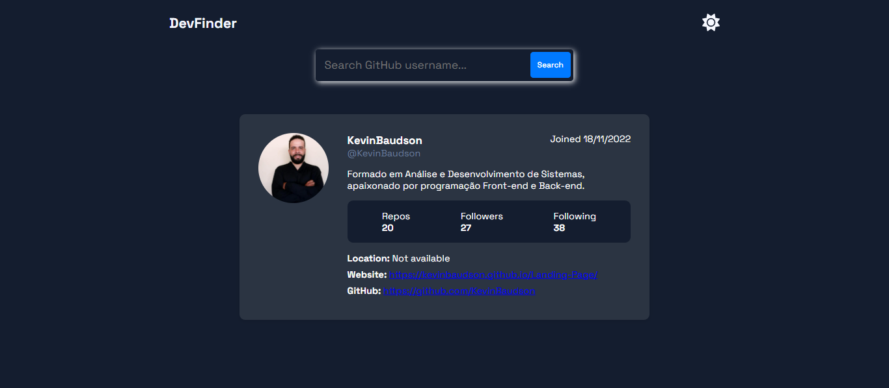
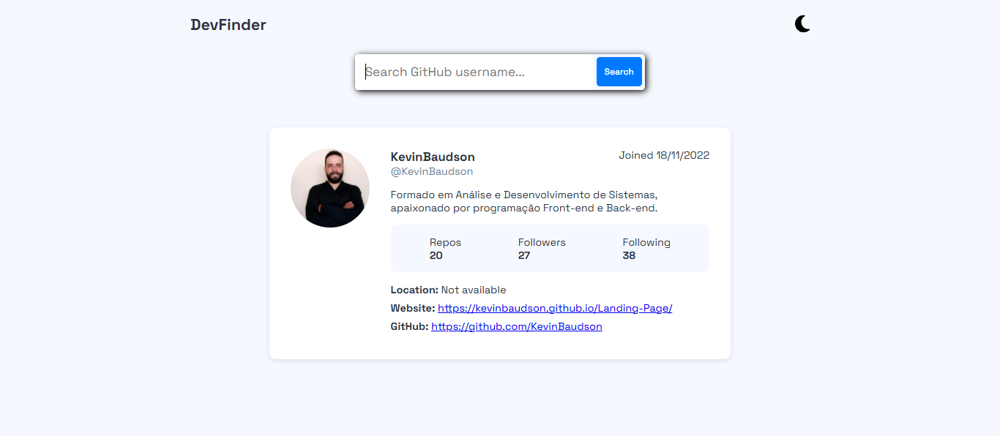

# 🔎 Find Dev

Aplicação web desenvolvida com React + Vite que permite buscar usuários do GitHub e exibir suas principais informações de perfil. O projeto também conta com alternância entre tema claro e escuro (light/dark mode).

## 📸 Preview

 <!-- substitua pelo caminho correto da imagem ou use um link externo -->
 <!-- substitua pelo caminho correto da imagem ou use um link externo -->

## 🚀 Deploy

Acesse o projeto online pelo GitHub Pages:  
👉 [preview DevFinder](https://kevinbaudson.github.io/devfinder/)

## 🧑‍💻 Funcionalidades

- 🔍 Busca por usuários do GitHub
- 📊 Exibição de dados como:
  - Nome e login
  - Bio
  - Número de repositórios públicos
  - Seguidores e seguindo
  - Localização e link para o perfil
- 🌙 Alternância entre tema claro e escuro
- ⚠️ Mensagens de erro e carregamento amigáveis

## 🛠️ Tecnologias Utilizadas

- [ReactJS](https://reactjs.org/)
- [Vite](https://vitejs.dev/)
- [Font Awesome](https://fontawesome.com/)
- [GitHub API](https://api.github.com/)
- CSS Modules

## 📂 Estrutura de Pastas

```
find-dev/
├── public/
├── src/
│   ├── components/
│   │   ├── Header/
│   │   ├── SearchInput/
│   │   └── ContainerData/
│   ├── App.jsx
│   ├── main.jsx
│   └── assets/
├── vite.config.js
├── package.json
└── README.md
```


## ⚙️ Instalação e Uso

```bash
# Clone o repositório
git clone https://github.com/kevinbaudson/find-dev.git

# Acesse a pasta
cd find-dev

# Instale as dependências
npm install

# Rode o projeto localmente
npm run dev
📦 Deploy para GitHub Pages
O deploy é feito com o pacote gh-pages. Basta rodar:

bash
Copiar
Editar
npm run deploy
O Vite está configurado com base: '/find-dev/' para garantir o funcionamento no GitHub Pages.

🤝 Contribuição
Sinta-se à vontade para abrir issues ou enviar pull requests com sugestões de melhoria.
